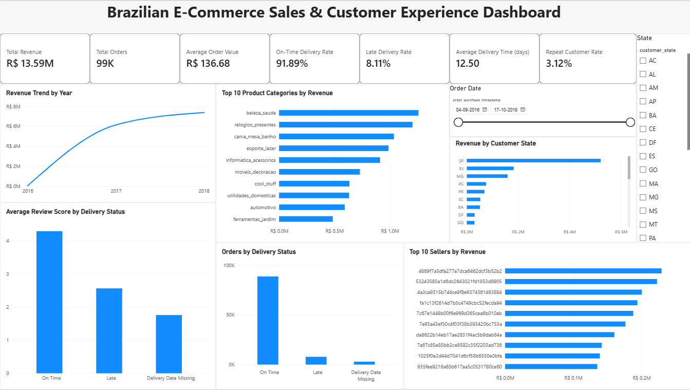

# Brazilian E-commerce Sales and Customer Analytics

## Introduction

The dataset contains 100,000+ orders from a Brazilian e-commerce marketplace between 2016 and 2018. It includes customer, seller, product, order, and location data, covering 95% of all sales in that period.

## Business Problem

The company wants to understand its e-commerce performance across products, customers, sellers, locations and delivery operations. The objective is to identify the major drivers of revenue, understand customer behavior, evaluate delivery performance, and determine factors associated with customer satisfaction.

## Business questions
1. What is the overall sales performance?
2. Which categories generate the most revenue?
3. Which sellers perform best?
4. Which states generate the most orders?
5. What is the average order value?
6. How has revenue changed over time?
7. How long does it take to deliver orders?
8. Does late delivery affect review scores?
9. Which categories have poor customer satisfaction?
10. What actions should management take?

## Tools & Technologies

- Microsoft Excel — Data cleaning, transformation, PivotTables, PivotCharts, KPI analysis and dashboard
- SQL — Data querying and business analysis
- Python — Data analysis and visualization
- Statistics — Statistical analysis and hypothesis testing
- Power BI — Interactive business intelligence dashboard
- GitHub — Project documentation and version control

## Dataset

The project uses the Brazilian E-Commerce Public Dataset (Olist), containing approximately 100,000 orders from 2016 to 2018.

The dataset includes information related to:

- Orders
- Customers
- Sellers
- Products
- Order items
- Product categories
- Customer and seller locations
- Order delivery information

## Project Structure

```text
brazilian-ecommerce-data-analysis/
│
├── data/
├── docs/
├── excel/
├── powerbi/
├── python/
├── screenshots/
├── sql/
├── statistics/
└── README.md
```

## Analysis Workflow

The project follows an end-to-end data analytics workflow:

1. Data understanding and quality checks
2. Data cleaning and transformation using Excel
3. Exploratory business analysis
4. SQL-based analysis
5. Python-based analysis and visualization
6. Statistical analysis
7. Power BI dashboard development
8. Business insights and recommendations
9. Documentation and version control using GitHub

## Excel Analysis

The first stage of the project was completed using Microsoft Excel.

The Excel analysis includes:

1. Data quality checks
2. Product category translation
3. Data cleaning and transformation
4. Revenue analysis
5. Monthly revenue trends
6. Average Order Value (AOV)
7. Delivery performance analysis
8. Customer and seller geographic analysis
9. PivotTables and PivotCharts
10. Interactive dashboard with slicers

## Key Excel Findings

- Total Revenue: $13,591,643.70
- Total Orders: 99,441
- Average Order Value: $136.68
- On-Time Delivery Rate: 93.23%
- Late Delivery Rate: 6.77%
- Average Items per Order: 1.13
- Top 10 product categories contribute approximately 62.36% of total revenue
- São Paulo is the largest customer and seller market

Detailed Excel methodology and analysis are documented in:

/docs/excel_analysis.md

## Excel Dashboard

The interactive Excel dashboard provides a consolidated view of revenue, product performance, customer geography, and delivery performance.

Interactive filters include:

- Order Month
- Customer State

## Current Project Status

|Phase | Status |
|:---|:---|
|Excel| Completed |
|SQL| Upcoming |
|Python| Upcoming |
|Statistics| Upcoming |
|Power BI| Upcoming |
|Final Business Insights| Upcoming |

## Power BI Dashboard

An interactive Power BI dashboard was created to monitor:

- Total Revenue
- Total Orders
- Average Order Value
- On-Time Delivery Rate
- Late Delivery Rate
- Average Delivery Time
- Repeat Customer Rate
- Revenue Trend
- Top 10 Product Categories
- Revenue by Customer State
- Orders by Delivery Status
- Average Review Score by Delivery Status
- Top 10 Sellers by Revenue

### Dashboard Preview



The Power BI dashboard provides interactive filtering by customer state and order date.

## Project Snapshot

| Metric | Result |
|---|---:|
| Total Revenue | R$ 13.59M |
| Total Orders | 99,441 |
| Average Order Value | R$ 136.68 |
| Average Delivery Time | 12.56 days |
| Repeat Customer Rate | 3.12% |
| Average Review Score | 4.09 / 5 |
| Top 10 Category Revenue Share | 62.36% |
| Top 10 Seller Revenue Share | 13.15% |

## Key Business Insights

- Total revenue reached approximately R$13.59M across 99,441 orders.
- The average order value was R$136.68.
- The top 10 product categories generated 62.36% of total revenue, indicating significant category concentration.
- The top 10 sellers contributed 13.15% of total revenue, showing relatively lower seller-level concentration.
- São Paulo was the largest customer market, contributing approximately 38.28% of total customer-side revenue.
- Repeat customers represented only 3.12% of unique customers, highlighting an opportunity to improve customer retention.
- Average delivery time was approximately 12.56 days.
- Late deliveries were associated with substantially lower customer review scores than on-time deliveries.
- Statistical analysis found a significant negative association between delivery delay and review score.